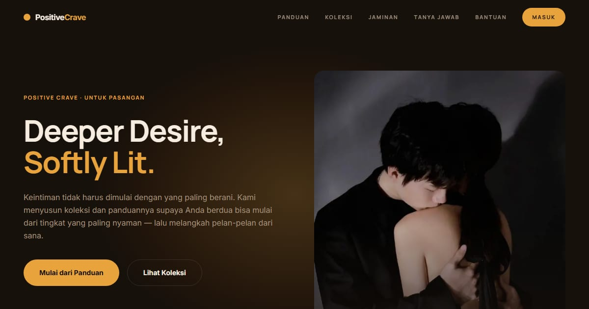

# Positive Crave — Konsep Amber

Landing page Positive Crave konsep "Amber": keintiman modern dengan kehangatan amber — passion meets precision.

**Demo live:** https://crave-amber-mu.vercel.app



> Konsep desain untuk kontes brief Positive Crave, bukan toko resmi. Checkout dan login hanya purwarupa.

## Konsep

Konsep "Amber" dengan bahasa rupa **Cahaya Lilin**: hitam kecokelatan, cahaya amber yang melingkar lembut, dan semua sudut dibulatkan. Nadanya menenangkan, kebalikan dari bidang keras varian Noir.

## Halaman

`/` · `/checkout` · `/forgot` · `/masuk` · `/produk` · `/register`

## Teknologi

- Next.js 15.5 (App Router) dan React 19
- Tailwind CSS v4
- JavaScript
- Framer Motion, Lucide (ikon)
- Font: Manrope, Inter (next/font)
- SEO: metadata per halaman, Open Graph, JSON-LD, sitemap.xml, dan robots.txt

## Menjalankan secara lokal

```bash
npm install
npm run dev
```

Buka http://localhost:3000. Untuk build produksi: `npm run build` lalu `npm start`.

---

Bagian dari koleksi 9 entri kontes desain web di [PortalKontes](https://portal-kontes.vercel.app). Dibuat oleh [PintuWeb](https://pintuweb.com), jasa pembuatan website.
